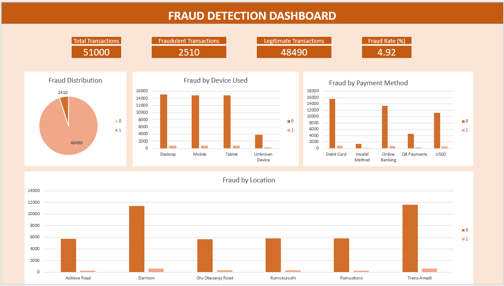

#  Digital Payment Fraud Analysis

##  Project Overview

This project analysed over 51,000 digital payment transactions to identify fraud patterns, operational risks, and behavioural indicators associated with fraudulent activities.

---

##  Business Problem

The organisation wanted to:
- Identify fraud trends.
- Evaluate high-risk customer behaviours.
- Assess fraud across payment channels and locations.
- Improve fraud detection strategies.

---

##  Tools Used

- Microsoft Excel
- PivotTables
- PivotCharts
- Dashboard
- Data Cleaning

---

##  Data Cleaning & Preparation

- Checked missing values.
- Standardised transaction fields.
- Validated numerical variables.
- Created fraud categories.
- Derived time-based variables.

---

##  Analysis

Fraudulent and legitimate transactions were compared across transaction types, payment methods, account types, customer behaviour, locations, and transaction times to identify operational risks.

---

##  Dashboard Preview

---

##  Key Insights

- Fraud represented a small proportion of transactions.
- Fraud occurred across all transaction types.
- Certain locations showed higher fraud concentrations.
- Fraud patterns varied by payment channel and account type.

---

##  Recommendations

- Strengthen fraud monitoring.
- Increase authentication for high-risk channels.
- Improve anomaly detection.
- Continuously monitor fraud hotspots.
