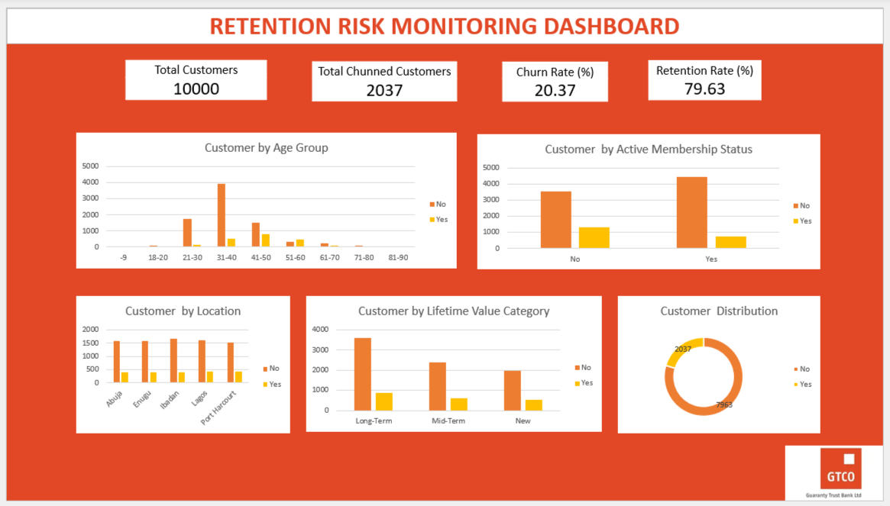

# Customer Churn Analysis

##  Project Overview

This project analysed customer demographics, financial behaviour, and service usage to identify factors influencing customer churn and recommend retention strategies.

---

##  Business Problem

The objective was to identify customers at risk of leaving and develop data-driven retention strategies.

---

##  Tools Used

- Microsoft Excel
- PivotTables
- PivotCharts
- Dashboard

---

##  Data Cleaning & Preparation

- Cleaned demographic data.
- Standardised categorical fields.
- Created age groups.
- Classified customer lifetime value.

---

##  Analysis

Customer churn was analysed across demographics, geography, tenure, balance, customer lifetime value, active membership, and credit card ownership.

---

##  Dashboard Preview

---

##  Key Insights

- Younger customers showed higher churn rates.
- Active members were more likely to stay.
- Higher-value customers demonstrated better retention.
- Churn differed across regions.

---

##  Recommendations

- Develop targeted retention campaigns.
- Improve engagement for inactive customers.
- Strengthen loyalty programmes.

